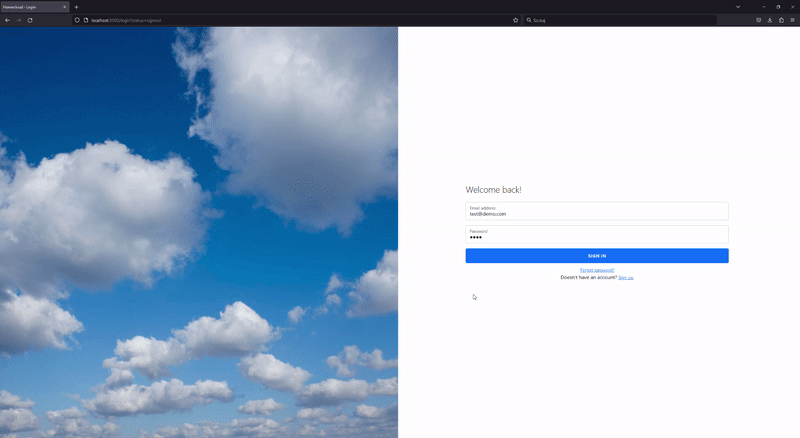

# homestorage
Home file storing system written in Go that utilizes SWT library for user authentication.

## Usage example

## Usage
1. Download or copy repository
2. Open a terminal or command prompt in the same directory as the Dockerfile.
3. Build the Docker image by running the following command:
`docker build -t homestorage .`
This will build the Docker image and tag it as homestorage.

5. Once the build is complete, run a container based on the image with the following command:
`docker run homestorage`

This will start the container and execute your Go application.
